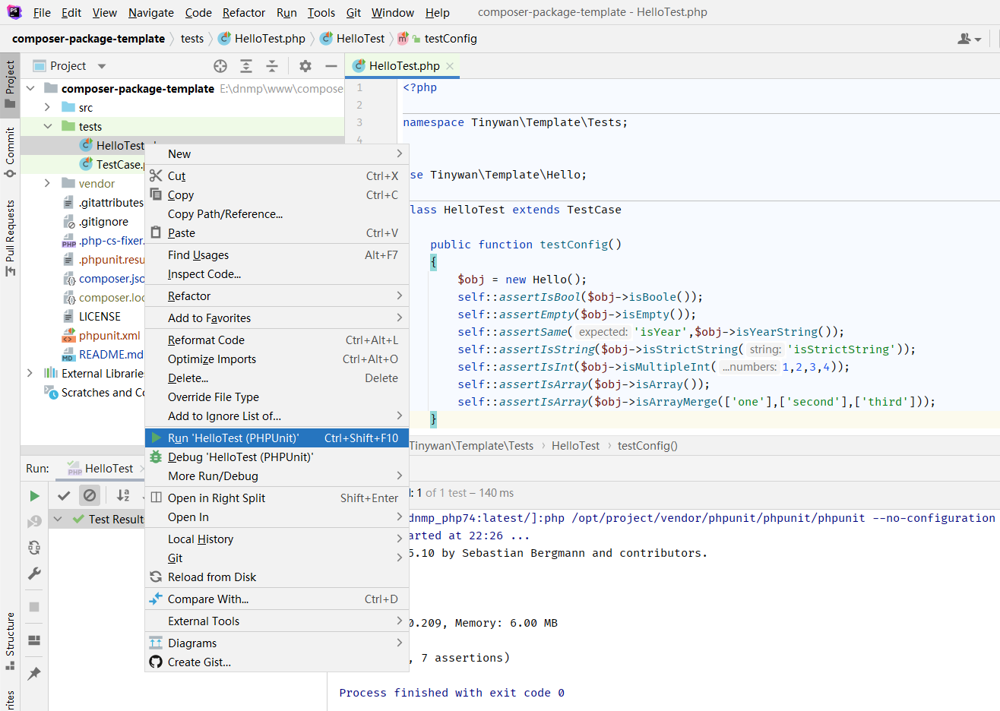

# composer-package-template
composer-package-template

## Installation

```php
docker run --rm --interactive --tty -v e:/dnmp/www/composer-package-template:/app composer install
```

## PSR规范之 php-cs-fixer 

### （1）格式化项目
```php
/var/www/composer-package-template # vendor/friendsofphp/php-cs-fixer/php-cs-fixer fix
Loaded config default from "/var/www/composer-package-template/.php-cs-fixer.php".
   1) composer-package-template/src/Exception/Exception.php
   2) composer-package-template/src/Exception/InvalidConfigException.php
   3) composer-package-template/src/Exception/ServiceNotFoundException.php
   4) composer-package-template/src/functions.php
   5) composer-package-template/src/Hello.php
```

### （2）通过脚本格式代码
```php
$ docker run --rm --interactive --tty -v e:/dnmp/www/composer-package-template:/app composer run-script phpcs
> vendor/bin/php-cs-fixer fix
Loaded config default from "/app/.php-cs-fixer.php".
   1) /app/src/Hello.php

Fixed all files in 0.492 seconds, 12.000 MB memory used
```

### 选项
```php
--format 输出文件格式，支持txt、xml
--verbose 
--level 应用哪种PSR类型。支持psr0、psr1、psr2。默认是psr2
--dry-run 显示需要修复但是没有修复的代码

php php-cs-fixer.phar fix /path/to/project --level=psr0
php php-cs-fixer.phar fix /path/to/project --level=psr1
php php-cs-fixer.phar fix /path/to/project --level=psr2
php php-cs-fixer.phar fix /path/to/project --level=symfony
```

## 单元测试

### （1）IDE



### （2）命令phpunit
```
./vendor/bin/phpunit -c phpunit.xml --colors=always
```

### （3）通过 composer run-script
```php
$ docker run --rm --interactive --tty -v e:/dnmp/www/composer-package-template:/app composer run-script test
> vendor/bin/php-cs-fixer fix
Loaded config default from "/app/.php-cs-fixer.php".
   1) /app/src/Hello.php

Fixed all files in 0.492 seconds, 12.000 MB memory used
```
